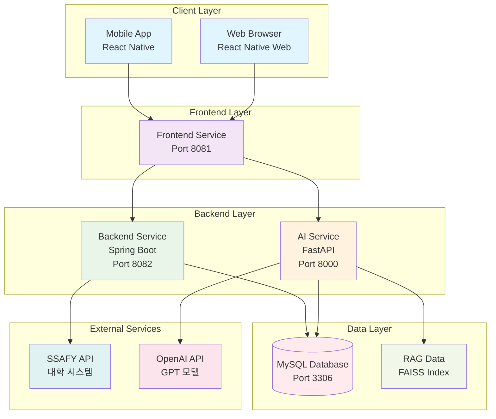
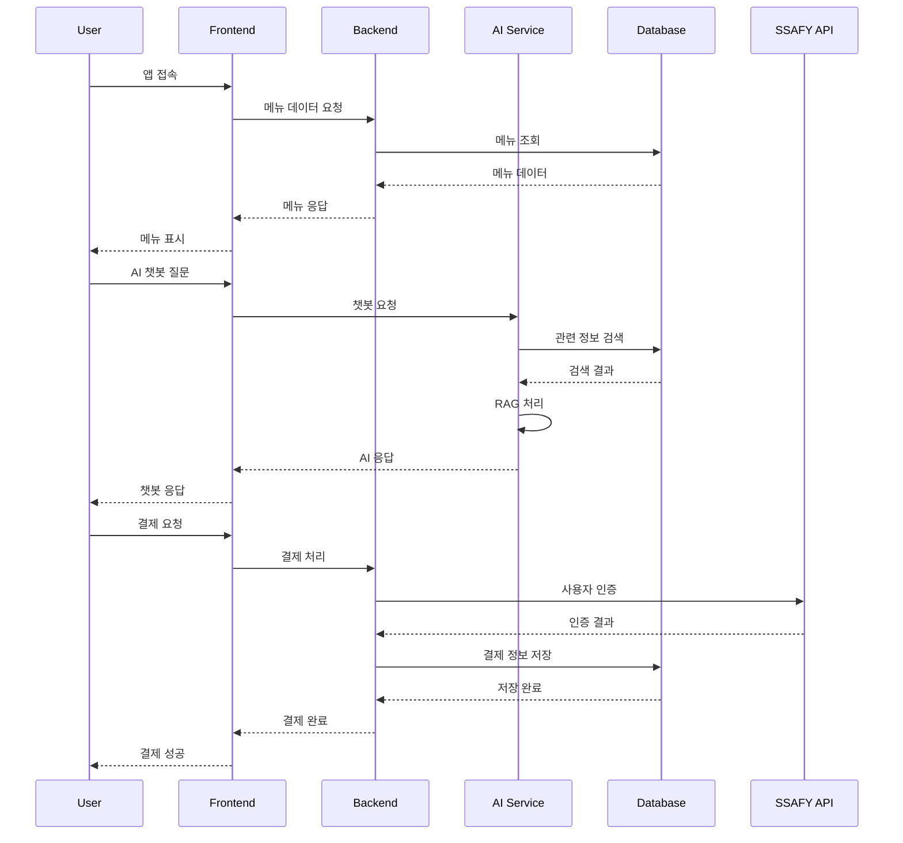
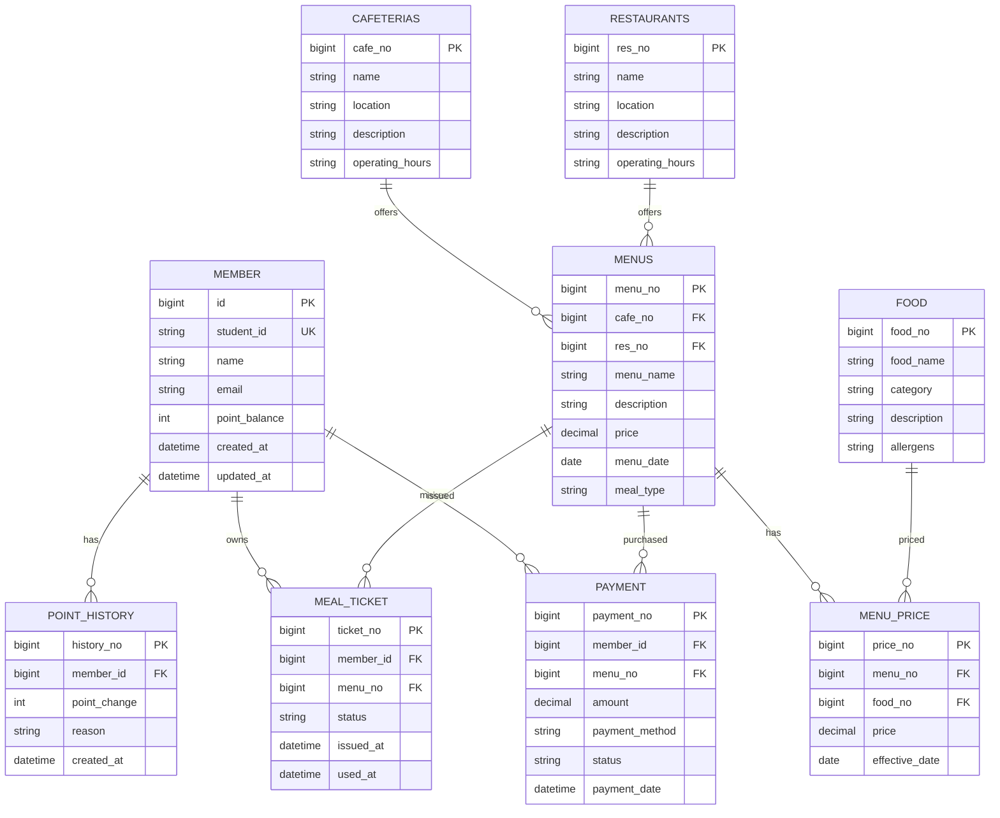
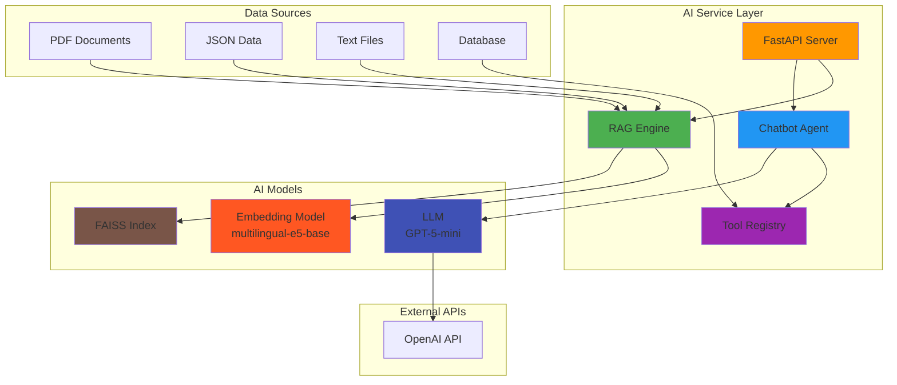
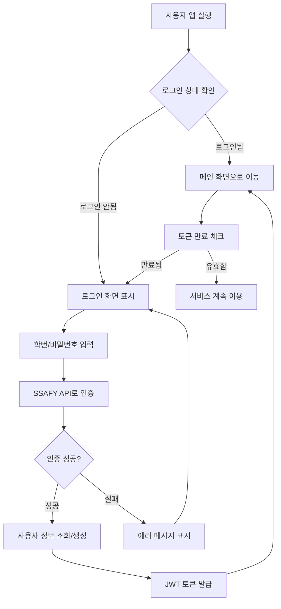
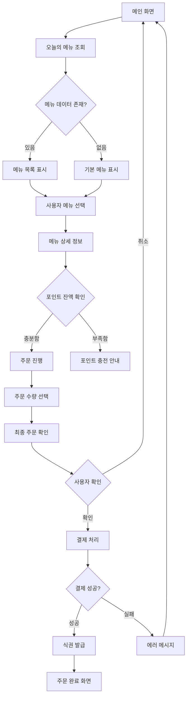
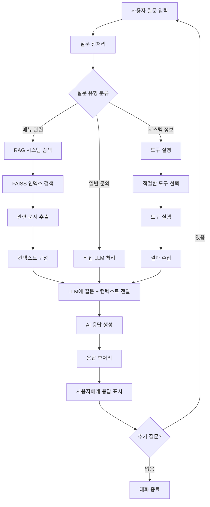
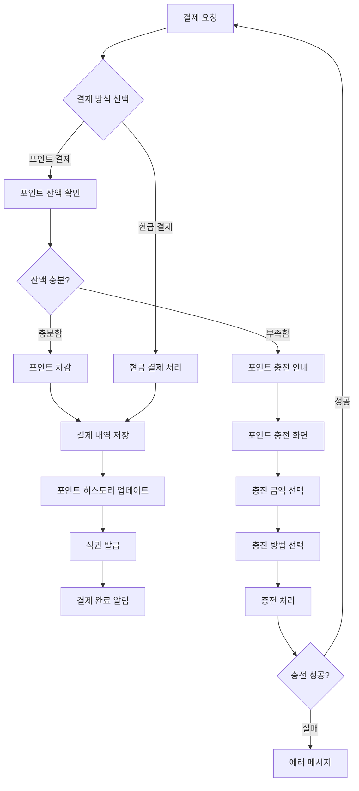
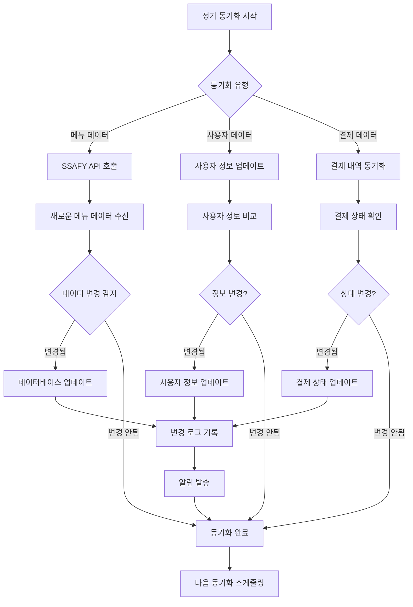

# Bapsim - 풀스택 대학 식당 관리 시스템

Spring Boot 백엔드, React Native 프론트엔드, Python AI 서비스로 구성된 대학 식당 관리 시스템입니다.

## 🏗️ 프로젝트 구조

```
Bapsim/
├── backend/                    # Spring Boot 백엔드
│   ├── src/main/java/com/bapsim/
│   │   ├── controller/         # REST API 컨트롤러
│   │   ├── service/           # 비즈니스 로직 서비스
│   │   ├── repository/        # 데이터 액세스 레이어
│   │   ├── entity/            # JPA 엔티티
│   │   ├── dto/               # 데이터 전송 객체
│   │   └── config/            # 설정 클래스
│   ├── src/main/resources/    # 설정 파일 및 데이터
│   ├── build.gradle           # Gradle 설정
│   └── Dockerfile             # 백엔드 Docker 이미지
├── frontend/                   # React Native 프론트엔드
│   ├── app/                   # 메인 앱 화면
│   ├── components/            # 재사용 가능한 컴포넌트
│   ├── screens/               # 화면별 스타일
│   ├── package.json           # Node.js 의존성
│   └── Dockerfile             # 프론트엔드 Docker 이미지
├── AI/                        # Python AI 서비스
│   ├── app/                   # AI 애플리케이션 코드
│   ├── agents/                # AI 에이전트 및 도구
│   ├── rag_data/              # RAG 데이터 및 임베딩
│   ├── requirements.txt       # Python 의존성
│   └── Dockerfile             # AI 서비스 Docker 이미지
├── docker-compose.yml         # 전체 서비스 구성
└── README.md                  # 프로젝트 문서
```

## 🏛️ 시스템 구성 다이어그램

### 전체 시스템 아키텍처



### 서비스 간 데이터 흐름



### 데이터베이스 스키마



### AI 서비스 아키텍처



### 주요 워크플로우

#### 사용자 인증 및 로그인 플로우



#### 메뉴 조회 및 주문 플로우



#### AI 챗봇 서비스 플로우



#### 결제 및 포인트 관리 플로우



#### 데이터 동기화 및 백업 플로우



## 🚀 주요 기능

### 백엔드 (Spring Boot)
- **사용자 관리**: 회원가입, 로그인, 포인트 시스템
- **메뉴 관리**: 카페테리아/레스토랑 메뉴 조회 및 관리
- **결제 시스템**: 식권 구매, 포인트 결제
- **SSAFY API 연동**: 대학 시스템과의 연동

### 프론트엔드 (React Native)
- **크로스 플랫폼**: iOS, Android, Web 지원
- **메뉴 탐색**: 오늘의 메뉴, 주간 식단
- **결제 인터페이스**: 간편한 식권 구매
- **AI 챗봇**: 메뉴 추천 및 문의 응답

### AI 서비스 (Python)
- **RAG 시스템**: 대학 식당 정보 기반 질의응답
- **챗봇**: 사용자 문의에 대한 지능형 응답
- **메뉴 추천**: 개인 취향 기반 메뉴 추천

## 📋 요구사항

### 시스템 요구사항
- **Java 17** 이상
- **Node.js 18** 이상
- **Python 3.9** 이상
- **Docker Desktop** 또는 **Docker Engine**

### 개발 도구
- **Gradle** (백엔드)
- **npm/yarn** (프론트엔드)
- **pip** (AI 서비스)

## 🚀 빠른 시작

### 1. 전체 서비스 실행
```bash
# 모든 서비스 실행
docker-compose up --build -d

# 로그 확인
docker-compose logs -f
```

### 2. 개별 서비스 실행

#### 백엔드만 실행
```bash
cd backend
./gradlew bootRun
```

#### 프론트엔드만 실행
```bash
cd frontend
npm install
npm start
```

#### AI 서비스만 실행
```bash
cd AI
pip install -r requirements.txt
python app/main.py
```

## 🌐 서비스 접속

- **백엔드 API**: http://localhost:8080
- **프론트엔드**: http://localhost:3000 (개발 모드)
- **AI 서비스**: http://localhost:8000

## 📚 API 엔드포인트

### 사용자 관리
- `POST /api/members/login` - 로그인
- `POST /api/members/register` - 회원가입
- `GET /api/members/{id}` - 회원 정보 조회

### 메뉴 관리
- `GET /api/menus` - 전체 메뉴 조회
- `GET /api/menus/cafeteria/{cafeNo}` - 카페테리아 메뉴
- `GET /api/menus/restaurant/{resNo}` - 레스토랑 메뉴
- `GET /api/menus/date/{date}` - 특정 날짜 메뉴

### 결제 시스템
- `POST /api/payments` - 결제 처리
- `GET /api/payments/history` - 결제 내역
- `GET /api/points/balance` - 포인트 잔액

### AI 서비스
- `POST /api/ai/chat` - 챗봇 대화
- `POST /api/ai/recommend` - 메뉴 추천

## 🧪 테스트

### 백엔드 테스트
```bash
cd backend
./gradlew test
```

### 프론트엔드 테스트
```bash
cd frontend
npm test
```

### AI 서비스 테스트
```bash
cd AI
python -m pytest
```

## 🛠️ 개발 환경 설정

### 로컬 개발 (Docker 없이)

#### 백엔드
```bash
cd backend
./gradlew bootRun
```

#### 프론트엔드
```bash
cd frontend
npm install
npm start
```

#### AI 서비스
```bash
cd AI
pip install -r requirements.txt
python app/main.py
```

### Docker 개발
```bash
# 특정 서비스만 빌드
docker-compose build backend
docker-compose build frontend
docker-compose build ai-service

# 특정 서비스만 실행
docker-compose up backend
docker-compose up frontend
docker-compose up ai-service
```

## 🔧 설정

### 환경 변수
`.env` 파일을 생성하여 환경 변수를 설정할 수 있습니다:

```env
# 데이터베이스
DB_HOST=localhost
DB_PORT=3306
DB_NAME=bapsim_db
DB_USER=bapsim_user
DB_PASSWORD=bapsim_password

# AI 서비스
AI_API_KEY=your_api_key
AI_MODEL=gpt-4
```

### 데이터베이스 설정
`backend/src/main/resources/application.yml`에서 데이터베이스 연결 정보를 수정할 수 있습니다.

## 📊 모니터링

### 컨테이너 상태 확인
```bash
docker-compose ps
```

### 로그 확인
```bash
# 모든 서비스 로그
docker-compose logs -f

# 특정 서비스 로그
docker-compose logs -f backend
docker-compose logs -f frontend
docker-compose logs -f ai-service
```

### 데이터베이스 접속
```bash
docker exec -it bapsim-mysql mysql -u bapsim_user -p bapsim_db
```

## 🛑 서비스 중지

```bash
# 모든 서비스 중지
docker-compose down

# 특정 서비스만 중지
docker-compose stop backend
docker-compose stop frontend
docker-compose stop ai-service
```

## 🧹 정리

### Docker 리소스 정리
```bash
# 모든 컨테이너, 네트워크, 볼륨 삭제
docker-compose down -v

# 사용하지 않는 Docker 리소스 정리
docker system prune -f
```

## 🔍 문제 해결

### 일반적인 문제들

1. **포트 충돌**
   - `docker-compose.yml`에서 포트 매핑 확인
   - 이미 사용 중인 포트 변경

2. **데이터베이스 연결 실패**
   - MySQL 컨테이너 완전 시작 대기
   - `docker-compose logs mysql`로 로그 확인

3. **프론트엔드 빌드 실패**
   - Node.js 버전 확인 (18 이상)
   - `npm cache clean --force` 실행

4. **AI 서비스 오류**
   - Python 버전 확인 (3.9 이상)
   - 의존성 재설치: `pip install -r requirements.txt --force-reinstall`

### 로그 확인
```bash
# 특정 서비스 로그
docker-compose logs backend
docker-compose logs frontend
docker-compose logs ai-service
```

## 📝 라이센스

이 프로젝트는 MIT 라이센스 하에 배포됩니다.

## 🤝 기여

버그 리포트나 기능 제안은 이슈를 통해 제출해주세요.

---

**Happy Coding! 🎉**
